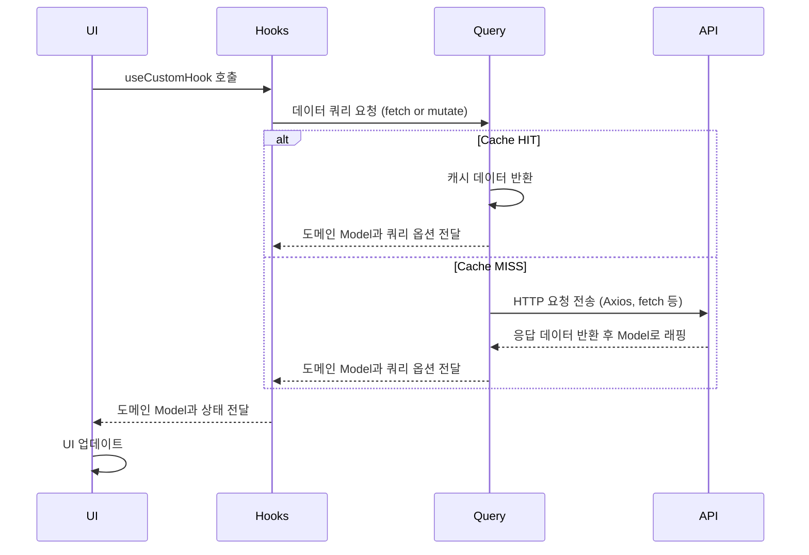
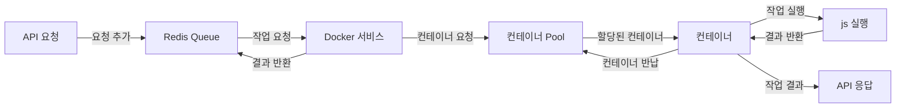

<h1>Froxy</h1>

<h6>빠르고 간편하게 코드를 실행하세요 🐸</h6>

> Froxy는 개구리를 뜻하는 ‘Frog’와 ‘Proxy’의 합성어로, 사용자가 직접 코드를 실행하지 않고도 결과를 빠르게 확인할 수 있는 서비스입니다. 🐸💻  
>
> Gist에서 코드를 복제하고 실행 환경을 설정하는 번거로움 없이, Froxy와 함께라면 폴짝! 뛰어넘어 간편하게 코드를 실행하고 결과를 확인할 수 있습니다. 다양한 기능을 통해 코드를 테스트하고 실행 결과를 즉시 확인해 보세요!

 

<h3>
<a href="https://www.frog-froxy.site/">지금 코드 실행하러 가기</a>
</h3>

[팀 노션](https://freckle-calliandra-79a.notion.site/Team38-F-Rog-12d9038c617380509fbdf4eb928e4238)
|
[팀 피그마](https://camo.githubusercontent.com/8a61ef97622df78c36d2ac0c400be9d154e0a756137e6752117de9bc1a78660a/68747470733a2f2f696d672e736869656c64732e696f2f62616467652f4669676d612d4632344531453f7374796c653d666f722d7468652d6261646765266c6f676f3d6669676d61266c6f676f436f6c6f723d7768697465)
|
[팀 피그잼](https://www.figma.com/board/NYv2EBl18ZcY9sxcYuqn9M/%ED%8C%80-%ED%94%84%EB%A1%9C%EC%A0%9D%ED%8A%B8-%EB%B3%B4%EB%93%9C!?node-id=0-1&node-type=canvas&t=USILPXIX2R8atRyd-0)
|
[개발 위키](https://freckle-calliandra-79a.notion.site/12d9038c6173807297b4d21e68b642c8)

<h2>목차</h2>

- [주제 선정 동기](https://github.com/boostcampwm-2024/web38-Froxy#%EF%B8%8F-%EC%A3%BC%EC%A0%9C-%EC%84%A0%EC%A0%95-%EB%8F%99%EA%B8%B0)
- [주요 기능](https://github.com/boostcampwm-2024/web38-Froxy#%EC%A3%BC%EC%9A%94-%EA%B8%B0%EB%8A%A5)
  - [Gist 코드를 빠르게 게시하기](https://github.com/boostcampwm-2024/web38-Froxy#gist-%EC%BD%94%EB%93%9C%EB%A5%BC-%EB%B9%A0%EB%A5%B4%EA%B2%8C-%EA%B2%8C%EC%8B%9C%ED%95%98%EA%B8%B0)
  - [다른 사람의 Gist 확인하기](https://github.com/boostcampwm-2024/web38-Froxy#%EB%8B%A4%EB%A5%B8-%EC%82%AC%EB%9E%8C%EC%9D%98-gist-%ED%99%95%EC%9D%B8%ED%95%98%EA%B8%B0)
  - [Gist 코드를 빠르게 실행하기](https://github.com/boostcampwm-2024/web38-Froxy#gist-%EC%BD%94%EB%93%9C%EB%A5%BC-%EB%B9%A0%EB%A5%B4%EA%B2%8C-%EC%8B%A4%ED%96%89%ED%95%98%EA%B8%B0)
- [FE 기술적 도전](https://github.com/boostcampwm-2024/web38-Froxy#fe-%EA%B8%B0%EC%88%A0%EC%A0%81-%EB%8F%84%EC%A0%84)

  - [QueryKey Factory로 QueryKey 구조화 하기](https://github.com/boostcampwm-2024/web38-Froxy#querykey-factory%EB%A1%9C-querykey-%EA%B5%AC%EC%A1%B0%ED%99%94-%ED%95%98%EA%B8%B0)
  - [계층화와 도메인 모델](https://github.com/boostcampwm-2024/web38-Froxy#%EA%B3%84%EC%B8%B5%ED%99%94%EC%99%80-%EB%8F%84%EB%A9%94%EC%9D%B8-%EB%AA%A8%EB%8D%B8)
  - [MSW로 개발 효율화하기](https://github.com/boostcampwm-2024/web38-Froxy#msw%EB%A1%9C-%EA%B0%9C%EB%B0%9C-%ED%9A%A8%EC%9C%A8%ED%99%94%ED%95%98%EA%B8%B0)
  - [Suspense, ErrorBoundary로 Fallback 구현하기](https://github.com/boostcampwm-2024/web38-Froxy#suspense-errorboundary%EB%A1%9C-fallback-%EA%B5%AC%ED%98%84%ED%95%98%EA%B8%B0)

- [BE 기술적 도전](https://github.com/boostcampwm-2024/web38-Froxy#be-%EA%B8%B0%EC%88%A0%EC%A0%81-%EB%8F%84%EC%A0%84)

  - [docker를 이용한 코드 실행](https://github.com/boostcampwm-2024/web38-Froxy#docker%EB%A5%BC-%EC%9D%B4%EC%9A%A9%ED%95%9C-%EC%BD%94%EB%93%9C-%EC%8B%A4%ED%96%89)
  - [queue & pool을 이용한 스케줄링](https://github.com/boostcampwm-2024/web38-Froxy#queue--pool%EC%9D%84-%EC%9D%B4%EC%9A%A9%ED%95%9C-%EC%8A%A4%EC%BC%80%EC%A4%84%EB%A7%81)
  - [Octokit 클라이언트 대신 직접 Gist API 모듈화](https://github.com/boostcampwm-2024/web38-Froxy#octokit-%ED%81%B4%EB%9D%BC%EC%9D%B4%EC%96%B8%ED%8A%B8-%EB%8C%80%EC%8B%A0-%EC%A7%81%EC%A0%91-gist-api-%EB%AA%A8%EB%93%88%ED%99%94)
  - [TypeORM을 통한 다대다 테이블 관리](https://github.com/boostcampwm-2024/web38-Froxy#typeorm%EC%9D%84-%ED%86%B5%ED%95%9C-%EB%8B%A4%EB%8C%80%EB%8B%A4-%ED%85%8C%EC%9D%B4%EB%B8%94-%EA%B4%80%EB%A6%AC)

- [기술 스택](https://github.com/boostcampwm-2024/web38-Froxy#%EA%B8%B0%EC%88%A0-%EC%8A%A4%ED%83%9D)
- [프로젝트 아키텍처](https://github.com/boostcampwm-2024/web38-Froxy#-%ED%94%84%EB%A1%9C%EC%A0%9D%ED%8A%B8-%EC%95%84%ED%82%A4%ED%85%8D%EC%B2%98)
- [프로젝트 Flow](https://github.com/boostcampwm-2024/web38-Froxy#%ED%94%84%EB%A1%9C%EC%A0%9D%ED%8A%B8-flow)
- [팀원](https://github.com/boostcampwm-2024/web38-Froxy#-%ED%8C%80%EC%9B%90)

## ⭐️ 주제 선정 동기

부스트캠프 챌린지 과정에서는 매일 도전 과제를 수행하며, 동시에 그룹원들의 과제를 Gist를 통해 확인하고 피드백하는 시간을 가집니다.

이 과정에서 캠퍼들은 Gist 경로를 찾아 로컬 환경에 클론(clone)한 뒤 실행하는 일련의 과정을 반복하게 되며, 특히 익숙하지 않은 도구를 사용하면서 이를 수행할 때 여러 가지 개발 환경 문제를 겪게 됩니다.

Froxy는 이러한 반복적인 코드 확인과 실행 과정을 보다 간편하고 효율적으로 지원하기 위해 만들었습니다. Froxy는 캠퍼들이 실행 환경에서 발생하는 문제를 줄이고, 코드 리뷰와 피드백에 더 집중할 수 있는 환경을 제공합니다. 이를 통해 캠퍼들이 과제 수행과 코드 리뷰에 있어 생산성을 높이고, 학습 과정에 더 몰입할 수 있도록 돕는 것이 Froxy의 목표입니다.

<table>
    <tr>
        <td align="center">
            
            <h6>검색하기 어려운 표</h6>
        </td>
        <td align="center">
            
            <h6>그룹원을 태그나 제목으로 검색</h6>
        </td>
    </tr>
</table>

## 🐸 주요 기능

### Gist 코드를 빠르게 게시하기

> 사용자의 Gist 코드를 쉽고 빠르게 게시할 수 있게 만들었습니다.

### 다른 사람의 Gist 확인하기

> 다른 캠퍼가 올린 Gist를 빠르게 찾을 수 있습니다.

### Gist 코드를 빠르게 실행하기

> 코드의 입력값 제공해 빠르게 실행할 수 있습니다.

## 🧑🏻‍💻 FE 기술적 도전

Froxy의 프론트엔드에서는 서버 데이터를 효과적으로 UI로 전달하는 것이 핵심 과제였습니다. 이를 위해 아래와 같은 기술적 도전에 집중했습니다.

### QueryKey Factory로 QueryKey 구조화 하기

> [Effective QueryKey](https://github.com/boostcampwm-2024/web38-Froxy/wiki/%5B%EB%AF%BC%EC%9A%B0%5DEffective-Query-Key)

- Tanstack Query를 사용해 서버상태를 관리하고 있었기 때문에 각 도메인마다 **구조화된 QueryKey가** 필요했습니다.
- 이를 위해, API 계층에서 사용하는 fetch 함수를 인자로 받아 **QueryKey와 QueryFunction을 함께 동적으로 생성하는 QueryKey Factory를 구현**했습니다.
- 이를 통해 프론트 코드 전역에서 **구조화된 QueryOption들을 선언적으로 재사용**할 수 있었습니다.

### 계층화와 도메인 모델

> [나도 써 본 잘알려진 UI 패턴(프론트엔드 계층화, 도메인 모델 객체 활용)](<https://github.com/boostcampwm-2024/web38-Froxy/wiki/%5B%EB%AF%BC%EC%9A%B0%5D%EB%82%98%EB%8F%84-%EC%8D%A8%EB%B3%B4%EA%B3%A0-%EC%8B%B6%EC%9D%80-%EC%9E%98%EC%95%8C%EB%A0%A4%EC%A7%84-UI-%ED%8C%A8%ED%84%B4(%ED%94%84%EB%A1%A0%ED%8A%B8%EC%97%94%EB%93%9C-%EA%B3%84%EC%B8%B5%ED%99%94%EC%99%80,-%EB%8F%84%EB%A9%94%EC%9D%B8-%EB%AA%A8%EB%8D%B8-%EA%B0%9D%EC%B2%B4-%ED%99%9C%EC%9A%A9%ED%95%98%EA%B8%B0)>)

- 프론트엔드 코드의 유지보수성을 높이기 위해 계층화된 아키텍처를 도입했습니다.
- 각각의 계층(API, Query, Hook, UI)를 통해 추가 요구사항이 생겼을 때 필요한 코드를 **계층으로 분리해 독립적으로 개발**할 수 있었습니다.
- 또한 **도메인 모델**을 설계해 각각에 도메인에 필요한 **비즈니스 로직을 캡슐화**해 UI에서 불필요한 비즈니스 로직을 선언하지 않고 UI로직만 관리할 수 있도록 했습니다.

### MSW로 개발 효율화하기

> [MSW로 개발 효율화하기](https://github.com/boostcampwm-2024/web38-Froxy/wiki/MSW)

- **MSW**를 이용해서 백엔드의 API 개발이 완료되지 않은 상태에서 **API 호출과 관련된 시나리오를 테스트**할 수 있었습니다.
- MockRepository를 이용해 요청 조건에 따라 데이터를 **동적으로 응답**하도록 구현했습니다.
- 이를 통해 인증이 필요한 요청에 대한 로직이나 tanstack query를 미리 적용해보고 테스트해볼 수 있어서 나중에 실제 API를 연결할 때 빠르게 진행할 수 있었습니다.

### Suspense, ErrorBoundary로 Fallback 구현하기

> [Suspense, ErrorBoundary로 Fallback 구현하기](https://github.com/boostcampwm-2024/web38-Froxy/wiki/Suspense+ErrorBoundary)

<table>
  <tbody>
    <tr>
      <td align="center">
        
         
        <b>로딩 시 Fallback UI</b>
      </td>
      <td align="center">
        
         
        <b>에러 시 Fallback UI</b>
      </td>
    </tr>
  </tbody>
</table>

- 리액트를 선언적으로 사용하기 위해서 **로딩 상태는 Suspense**가, **에러 상태는 ErrorBoundary**가 관리하도록 역할을 분리하고자 했습니다.
- Layout Shift 문제 방지와 사용자 경험 개선을 위해서 **Skeleton UI**를 사용해서 로딩 시 fallback UI를 구현했습니다.
- ErrorBoundary와 tanstack query의 **useQueryErrorResetBoundary()** 훅을 이용해서 오류 발생 시 **재시도**가 가능하도록 에러 fallback UI를 구현했습니다.

## 🧑🏻‍💻 BE 기술적 도전

### docker를 이용한 코드 실행

> [dockerode를 이용한 컨테이너 관리](https://github.com/boostcampwm-2024/web38-Froxy/wiki/Dockerode%EB%A5%BC-%EC%9D%B4%EC%9A%A9%ED%95%9C-%EC%BB%A8%ED%85%8C%EC%9D%B4%EB%84%88-%EC%82%AC%EC%9A%A9)

- 쉘을 이용한 방법보다는 nest에서 직접 docker를 관리하고자 했습니다.
- git clone, image build보다 빠른 속도를 위해 컨테이너에 직접 파일을 parsing, 삽입하도록 구현했습니다.
- 컨테이너와 소켓을 통해 입출력 결과를 반환할 수 있습니다.

### queue & pool을 이용한 스케줄링

> [Redis-queue를 이용한 컨테이너 스케줄링](https://github.com/boostcampwm-2024/web38-Froxy/wiki/redis%E2%80%90queue%EB%A5%BC-%EC%9D%B4%EC%9A%A9%ED%95%9C-%EC%BB%A8%ED%85%8C%EC%9D%B4%EB%84%88-%EC%8A%A4%EC%BC%80%EC%A4%84%EB%A7%81)

- queue를 이용해 요청이 순차적으로 처리되도록 했습니다.
- container pool을 직접 관리하여 리소스 사용률을 감소시켰습니다.

### Octokit 클라이언트 대신 직접 Gist API 모듈화

> [사용자 지정 Gist API 파싱 모듈](https://github.com/boostcampwm-2024/web38-Froxy/wiki/%EC%82%AC%EC%9A%A9%EC%9E%90-%EC%A7%80%EC%A0%95-gist-api-%ED%8C%8C%EC%8B%B1-%EB%AA%A8%EB%93%88)

- GitHub 공식 client Octokit 모듈 사용이 nest와의 호환성 문제로 인하여 REST API를 통해 모듈을 직접 구현했습니다.
- 이때 type-safe한 환경을 만들기 위해서 응답과 요청에 대한 type 추론이 가능하도록 설계했습니다.
- 이는TypeScript의 장점을 최대한 활용할 수 있도록 dto로 파싱하여 응답을 필터링하고 유효성 검사를 할 수 있게 되었습니다.

### TypeORM을 통한 다대다 테이블 관리

> [typeORM 다대다 테이블 트러블 슈팅](https://github.com/boostcampwm-2024/web38-Froxy/wiki/typeORM-%EB%8B%A4%EB%8C%80%EB%8B%A4-%EC%86%8D%EC%84%B1-%EB%8D%B0%EC%9D%B4%ED%84%B0-%ED%8A%B8%EB%9F%AC%EB%B8%94-%EC%8A%88%ED%8C%85)

- update 함수를 쓰는 과정에서 **다대다 관계**의 데이터는 관계 테이블을 통해 연결되기 때문에, 직접 필드로 접근해 조건을 걸 수 없는 문제를 발견했습니다.
- 다대다 관계를 사용하는 repository에서 update 사용 시, 쉽게 보이는 오류이며 save로 임시로 오류를 막았으나 find 및 save로 인한 원자성 해침을 막기 위한 방침이 필요했습니다.
- 또한 tag 미사용 시 데이터를 자동으로 삭제하는 기능을 위해서, tag-lotus relation 테이블을 추가하여 one-many 관계로 분리하였습니다.

## 🔧 기술 스택

<table>
    <thead>
        <tr>
            <th>분류</th>
            <th>기술 스택</th>
        </tr>
    </thead>
    <tbody>
        <tr>
            <td>
                
공통

            </td>
            <td>
                
            </td>
        </tr>
        <tr>
            <td>
                  
프론트엔드

            </td>
            <td>
                  
                  
                  
                  
                   
            </td>
        </tr>
        <tr>
            <td>
                
백엔드

            </td>
            <td>
                
                
                
                
                
            </td>
        </tr>
                <tr>
            <td>
                
패키지 매니저

            </td>
            <td>
              
              
            </td>
        </tr>
                <tr>
            <td>
                
배포

            </td>
            <td>
                
                
                
                
            </td>
        </tr>
        <tr>
            <td>
                
협업

            </td>
            <td>
                
                
                
            </td>
        </tr>
    </tbody>
</table>

## 🔧 프로젝트 아키텍처

## 🔧 프로젝트 flow

## 👥 팀원

<table>
  <tr>
    <td></td>
    <td></td>
    <td></td>
    <td></td>
  </tr>
  <tr>
    <td align="center"><a href="https://github.com/ATeals">김민우</a></td>
    <td align="center"><a href="https://github.com/naarang">이나경</a></td>
    <td align="center"><a href="https://github.com/kimhji">김현지</a></td>
    <td align="center"><a href="https://github.com/mjh000526">문준호</a></td>
  </tr>
  
  <tr>
    <td align="center">FE</td>
    <td align="center">FE</td>
    <td align="center">BE</td>
    <td align="center">BE</td>
  </tr>
</table>
